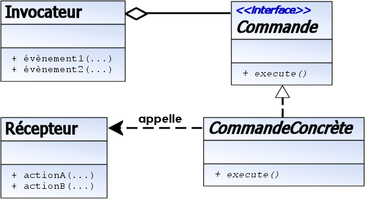
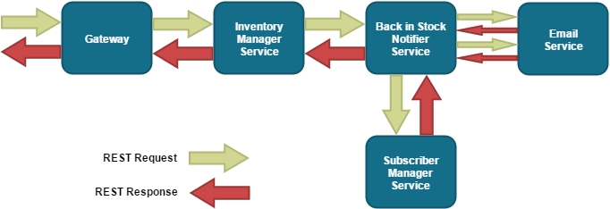
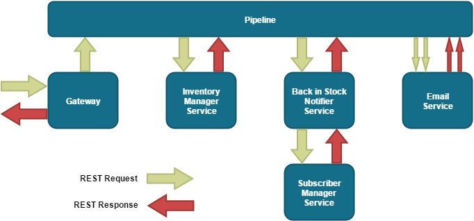

# Microservice
En informatique, les micro services sont un style d'architecture logicielle à partir duquel un ensemble complexe d'applications est décomposé en plusieurs processus indépendants et faiblement couplés, souvent spécialisés dans une seule tâche. Les processus indépendants communiquent les uns avec les autres en utilisant des API.

Les API peuvant êtres un librairies expostant une interface public, un EJB, u des services web tel que RESTfull.

Un microservice ou micro composant, fournit (expose) des services et en consome (utilisae) d'autres

Un avantage est que lors d'un besoin critique en une ressource, seul le microservice lié sera augmenté, contrairement à la totalité de l'application dans une architecture classique. L'autre avantage est une meilleur isolation lors des développements étant donnée le faible couplage, donc moins de coordination et test unitaire plus simple (meilleur encapsulation).

L'application finale sera la composition des microservices.

* Les services individuels sont simples à remplacer
* Les services sont conçus pour leur utilité spécifique (par exemple la facturation, la chaîne logistique, l'interface...)
* L'architecture est plus symétrique que hiérarchique (passage d'une architecture client-serveur à une architecture de plusieurs entités communicantes)
* L'architecture facilite le déploiement continu du code

La philosophie de l'architecture microservices s'inspire en grande partie de la philosophie UNIX, qui prône « ne faire qu'une seule chose, et la faire bien ». Elle est décrite comme suit1,2,3 :

* Les services sont petits, et conçus pour remplir une seule fonction.
* L'organisation du projet doit prendre en compte l'automatisation, le déploiement et les tests.
* Chaque service est élastique, résilient, composable, minimal et complet3.

# Plus d'effort pour définir les interfaces publique à long termes

## Quelques pattern de conceptions Utiles

### Commandes

commande est un patron de conception (design pattern) de type comportemental qui encapsule la notion d'invocation. Il permet de séparer complètement le code initiateur de l'action, du code de l'action elle-même. Ce patron de conception est souvent utilisé dans les interfaces graphiques où, par exemple, un élément de menu peut être connecté à différentes Commandes de façon que l'objet d'élément de menu n'ait pas besoin de connaître les détails de l'action effectuée par la Commande.

À utiliser lorsqu'il y a prolifération de méthodes similaires, et que le code de l'interface devient difficile à maintenir.

Symptômes :

Les objets possèdent trop de méthodes publiques à l'usage d'autres objets.
L'interface est inexploitable et on la modifie tout le temps.
Les noms des méthodes deviennent de longues périphrases.
Un objet commande sert à communiquer une action à effectuer, ainsi que les arguments requis. L'objet est envoyé à une seule méthode dans une classe, qui traite les commandes du type requis. L'objet est libre d'implémenter le traitement de la commande par un switch, ou un appel à d'autres méthodes (notamment des méthodes surchargées dans les sous-classes). Cela permet d'apporter des modifications aux commandes définies simplement dans la définition de la commande, et non dans chaque classe qui utilise la commande.



### Fonction de rappel
une fonction de rappel (callback en anglais) ou fonction de post-traitement est une fonction qui est passée en argument à une autre fonction. Cette dernière peut alors faire usage de cette fonction de rappel comme de n'importe quelle autre fonction, alors qu'elle ne la connaît pas par avance.
La technique de la fonction de rappel s'inspire du principe d'Hollywood (ou Inversion de contrôle) où l'appelant laisse ses coordonnées pour pouvoir être rappelé par la suite. L'intérêt est le passage à un modèle événementiel et modulaire.

Avec l'apparition de la programmation objet et des interfaces, la technique de rappel a évolué. On passe maintenant en paramètre un objet qui se conforme à une interface donnée. Il n'y a donc plus une, mais autant de fonctions que l'on souhaite rappeler. De plus le fait de passer un objet permet de contextualiser en indiquant sur quoi s'effectue le rappel, tandis qu'une fonction de rappel précisait seulement comment rappeler. Cependant la technique des fonctions de rappel continue à avoir les faveurs des langages disposant de fermetures (Cas des lambda Java8), où celles-ci offrent des capacités équivalentes aux objets en termes de contexte.

### Pattern: Database per service

Un schemas (ou ensemble de table d'un schemas) privé par micro service 

En Mysql par exemple

```SQL
create user 'realm-ms'@'localhost' identified by 'realm-ms';
create database realm;
GRANT ALL ON realm.* TO 'realm-ms'@'localhost';
```


## Librairie sous forme de services
Les services sont définis par une interface publique, L'implémentation est encapsulé et "privée". 

### Design pattern fabrique
La fabrique (factory method) est un patron de conception créationnel utilisé en programmation orientée objet. Elle permet d'instancier des objets dont le type est dérivé d'un type abstrait. La classe exacte de l'objet n'est donc pas connue par l'appelant.

Plusieurs fabriques peuvent être regroupées en une fabrique abstraite permettant d'instancier des objets dérivant de plusieurs types abstraits différents.

Les fabriques étant en général uniques dans un programme, on utilise souvent le patron de conception singleton pour les implémenter.


## Service web RESTfull comme microservice

Globalement comme pour les composants Un composant fournis des services en en consome d'autres on obtien par exemple ce genre de conectivité entre eux



La connection entre composant au niveux des composant eux même.

## Pipeline 

Pour connecter les servcies entre eux (consome -> fournis) on definit un pipeline de fonctions



Commandes -> OperationPersitance

Commande Consomer ADDUSER definie par callback
Commande Fournit Callback ADDUSER
OperationPersitance Fournir ADDUSER

créer un RESULAT lierCommandOperation<PARAMAPPEL>

pipeline : [Racine]->[Commande]->[OperationPersistance]

